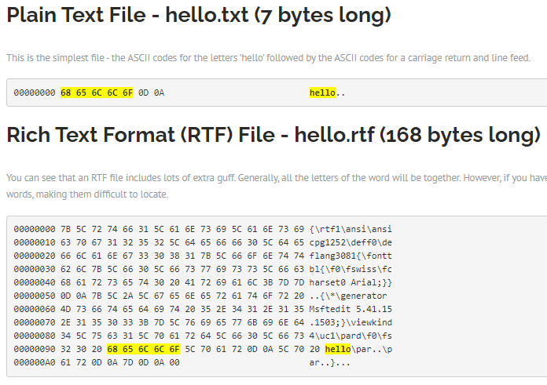
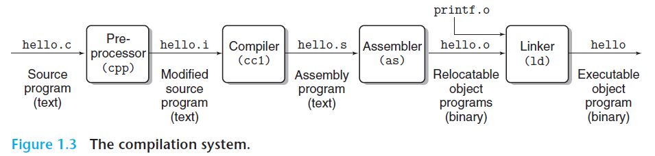

Book:  
Computer Systems. A Programmer’s Perspective [3rd ed.]  
page 59
### binary vs ASCII
All files are at heart binary files -- that is, a collection of 1s and 0s.  
And ASCII is one of the way that use numbers to represent the number and letters.  
And it's all about how we view it.
Let's say we have different files which all contains "hello" text only.  
like: plain text file, rich text format file, word document, unicode plain text file.  
We can use a hex editor to see what is exactly the "binary collection" in these files.  


### source code to executable binary file


### Processors Read and Interpret Instructions Stored in Memory
souce code
```c
#include <stdio.h>
int main()
{
printf("hello, world\n");
return 0;
}
```
assembly code
```aidl
1 main:
2 subq $8, %rsp
3 movl $.LC0, %edi
4 call puts
5 movl $0, %eax
6 addq $8, %rsp
7 ret
```


let's say we have a hello file which is compiled as executable file.  
and when we type "./hello" in bash and then click enter key, it will be executed and print out "hello world".  

### Process
Process it the abstraction of OS on CPU, main memory and IO devices.  
So it can provide the illusion that each program is the only one running on the system.  
And the context swith is the mechanism to concurrently run multiple processes.  
So the context involve, content of main memory, PC, register files.  

### OS heap & stack
stack: 
1. function variable(primitive values or reference to the objects in heap); function parameters; function return address
2. not need to allocate them yourself
3. LIFO(last in first out)

heap: other than stack, need to allocate.

### Process and thread
Difference:  
process is the smallest unit for OS to allocate resource.  
thread is the smallest unit for OS to execute tasks.  
One is for resource allocating and one is for tasks executing.  

what is the resource in process in allocating:  
registers, program counter, virtual memory address(stack, heap)

### Thread status
status: new, runnable, blocked, wait, timed_wait, terminated  
new -> runnable: thread.start() is called
runnable -> blocked: synchronized, lock.lock
runnable -> wait: object.wait 
runnable -> timed_wait: object.wait(time), sleep()

**blocked vs wait**
blocked is waiting for other thread to release the lock  
wait is waiting for other thread to notify it

**ReentrantLock doesn't use 'this' as object monitor**
```aidl
ReentrantLock lockA = new ReentrantLock();
lockA.lock();
lockA.wait(); //ERRPR. Will throw illegalMonitorStatException. Need synchronized here
```

**difference between object.wait vs unsafe.park**
no idea

### countdownlatch vs cyclicbarrier
countdownlatch.await: all threads blocks at count down to become 0 
cyclicbarrier.await: all threads blocks at count down to become 0, and then the cycic barrier will reset to original nunmber again

### cpu, core, hyper-thread
cpu can have several cores  
core: its own ALU, registers, PC  
hyper-thread: one ALU and several registers + PC(so that don't need the context switch)

### @? JVM本地变量表和CPU的寄存器类似
### @? What is DMA
direct memory access

### @? 缓存一致性
什么时候有使用到？如果有的话，还有多线程的问题吗？

### @？intel lock 汇编指令
hotspot的volatile和synchronize都用的lock来实现  
为什么可以实现
volatile怎么实现可见性和指令不可重排的

###
因为有缓存一致性机制，所以其实在cpu层面，是不存在共享数据竞争的。
多线程下的共享数据竞争，是因为指令重排，在编程习惯上，我们依赖于高层语言的代码执行顺序。却不知道他们在CPU层面是会被重排序的。
Java里面的volatile，其实就是禁止指令重排。用了内存屏障，前面的指令都会被执行完毕，再执行接下里的指令。防止乱序。
多线程下的共享资源竞争，更多的是因为没有原子性。比如说对同一个数的a++。他们都读到a，都加1，都往回set，结果就是1而不是2。这个是因为a的读取和plus和写入不是原子性的。所以要加同步锁。  
而volatile跟同步的关系是，


### 缓存一致性保证了内存可见性吗
不。有两方面的原因：
1. 在寄存器里待太久
2. 在store buffer(cpu和L1 cache之间的另一层缓存)待太久。
以上两者，都是还没有到缓存，所以被缓存一致性照顾不到的。
**内存屏障**可以解决这个问题
内存屏障是用来保证屏障之前的指令要在屏障之后的指令前执行结束。  
所以他意味着，load都要load完，store也要store完。注意这里目标说的都是到主存。而不是寄存器或者store buffer或者cache。  
所以，内存屏障保证了指令的有序性。  
java里面的volatile就是通过内存屏障来实现的。  


### 硬件内存屏障
sfence, lfence, mfence
lock（是一个full barrier）: 加在其他指令前面。保证原子性。lock add a。保证只有我修改这个a


### 线程与纤程
线程要用户态和内核态切换，所以是重量级的。  
纤程只在用户态，是轻量级的。

## @? 中断，软中断，硬中断

### class loading
loading, linking, initializing
it's all about class, not about object. 
in linking, static field will be set to default value, in initializing stat, the static field will be initialized. 
if you want to hack the parent-delegation loading, you need to override the loadClass method.

### @? 热加载，热部署

### @? 缓存一致性保证
1. 总线锁
    就相当于串行访问共享资源。前提是，你这个锁的释放，是在你资源完全访问完（不能说改过后却还没刷回主存）。
2. MESI协议（缓存锁）
    有些无法被缓存的数据，比如数据较大或者跨越多个缓存行的数据，依然必须使用总线锁。
    
### happened-before
定义的指令间的semi-order的关系。 
A relation between the **result** of two events.  
If one event should happen before another event, **the result** must reflect that, even if those events are in reality executed out of order.  
包含两个方面： 
1. in time 
2. in memory

注意的点： 
一个是，这个order的关系是对于进程内来说的，而不是局限于线程内。  
一个是，这个order不仅要反映时间，还要反映内存可见性。  

例子： 
happened-before in java memory model:
1. single thread rule
2. monitor lock rule
3. volatile variable rule
4. thread start rule
5. thread join rule
  
for example, monitor lock rule. in fact it's a mechanism that make the multithread "single thread" when they try to access shared data.  
so it's quite easy to understand the "happened-before" in the monitor lock.  
for another example, the volatile, if one thread writes in it, then other thread must can see its reuslt.  
It's also that kind of "order", means that I write first, and then you read.  
the logic hiden here is that, one thread B **cares about** the result of another thread A, so B said: hey A, you must run in the order and the result that I expect.  
And what A expect here is that:
B should run in the order that A knows(the program lines).  
A should see B's update.  
This is what volatile try to achieve here.  


### volatile 不保证 i++ 原子性
volatile 在hotspot的实现是lock指令：锁总线。 
只有一个线程对share data有使用权限。
所以照理来说，它是有原子性的。
但注意，像i++这种是没有原子性的。因为它是i = i + 1。是one read + one write.  
volatile保证的原子性只是，only one read. Or only one write.  
volatile和内存屏障的关系： 
用来实现volatile的lock指令是全屏障。 

### synchronized 实现
lock cmpxchg ... 
cmpxchg应该是原语。能够保证多个线程在一个cpu上的原子性。
lock是为了保证在多个**cpu**上

### 对象创建过程
1. class loading
2. class linking(verify, preparation, resolution). in preparation will set default value to static field 
3. class initilizing: static field set to the value and static code blcok executing
4. new a memory for the instance
5. instance init(constructor): set the value to fields and call constructors actions

### NIO
like read()：  
1. BIO: 线程阻塞等待内核从外围设备(File)读数据到内核空间，然后把数据从内核空间再放到用户空间。
2. NIO: 线程发请求给内核要求数据后，就去做他的事情。
然后不时来问一下内核数据准备好了（数据已经在内核空间了）没。
没有就再去做他的事情，过会儿再问。有就阻塞等待数据从内核空间拷到用户空间。

**多路复用multiplexing**
都是同步I/O。用户线程需要自己去轮询问Kernal相应的fd的IO是不是已经准备好在kernal空间了。然后阻塞从kernal空间拷贝数据到用户空间。
select()  
传给内核一个fd list，内核会回传那些IO ready的fd list回来。然后用户程序就可以去读数据了。
poll()
跟select非常相似。只是使用pollfd是链式结构，没有最大连接数。但是select是2048。
epoll()

**单线程怎么实现IO的高并发**


### 分布式锁
同一个进程间的线程之间的锁的意义的实现是，让他们先去获得一个共享的item的使用权。  
比如synchronized，和lock。  
synchronized是monitor enter和monitor exit，是为了把一个object的锁头的那个位置声明为自己所有。  
这中间有很多种方式，是一个锁升级的过程。但无论怎么样，都是为了去做这个声明。
这是线程之间。
而进程之间的话，比如说想控制不同的进程访问一个共享资源的顺序性。因为进程间数据是不能共享的，所以只能通过第三方介质。  
比如redis，zookeeper，数据库。


### IO缓冲流
好处是类似于批量处理，减少和IO的交互总次数（还有内核态用户态之间的切换）。


