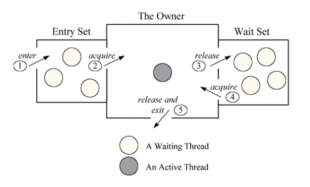

### atomic
(OS)<br/>
Atomic means no other threads can interrupt me and access same data with me.<br/>
They need to wait for me when i am fished.<br/>
Example:<br/>
Compare-and-set instruction in operation system.<br/>
(No other threads can access the word I am not access only after this instruction completes)
### lock & monitor<br/>
(Java)<br/>
**Lock**<br/>
Lock is a memory place at java object header which may contain the information that what thread is owning this object.<br/>
It's to guarantee that for the critical code region only one thread can access at one time.<br/>
What is critical code region?<br/>
Java provides primitives(synchronized) to designate critical code regions.<br/>
**Monitor**<br/>
Monitor is a construct that allows threads to have mutual exclusion and cooperation.<br/>
Lock is lock and only one thread can own that lock at one time.<br/>
But what about other threads which also try to get the lock or are waiting for the some condition to get the lock?<br/>
It should get help with monitor.<br/>
See image below:<br/>
Entry Set contains the threads that call lock() but pending there.<br/>
Wait Set contains the threads that call wait().<br/>
1. All threads in Entry Set will try to acquire the lock when the lock is release by the owner. But also only one thread can succeed getting the lock.<br/>
2. All threads in Entry Set will try to acquire the lock once the notifyAll() is called. They will all wake up but also only one can succeed getting the lock.<br/>

You can see here that the trigger condition is different:<br/>
1. Entry Set is the lock release action of the owner.
2. Wait Set is the notifyAll() action.


https://howtodoinjava.com/java/multi-threading/multithreading-difference-between-lock-and-monitor/
https://wiki.openjdk.java.net/display/HotSpot/Synchronization

### threads & shared data<br/>
|memory type|stored data type|shared or not|
|----|----|----|
|stack|primitive types and object references|not shared by threads|
|heap|objects|shared by threads|
|method area|class variables(compared to object variables)|shared by threads|

reference:<br/>
https://www.javaworld.com/article/2076971/how-the-java-virtual-machine-performs-thread-synchronization.html

### variable vs object<br/>
Variable is a reference that can change at anytime. Just like an address.<br/>
Object is an instance of a class in java.<br/>
Like below, foo is a variable and it references an object which is an instance of MyClass.<br/>

```
foo = new MyClass()
```
### make threads run in particular order
How to make threads run in one specific order?  
**3 threads in order**  
```java
Semaphor firstSm = new Semaphor(1);
Semaphor secondSm = new Semaphor(0);
Semaphor thirdSm = new Semaphor(0);

Thread1:
while(true){
    firstSm.acquire();
    business_logic();
    secondSm.release();
}

Thread2:
while(true){
    secondSm.acquire();
    business_logic();
    thirdSm.release();
}

Thread3:
while(true){
    thirdSm.acquire();
    business_logic();
    firstSm.release();
}


```
